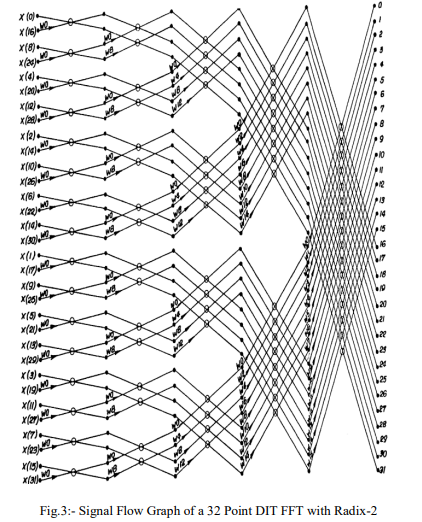
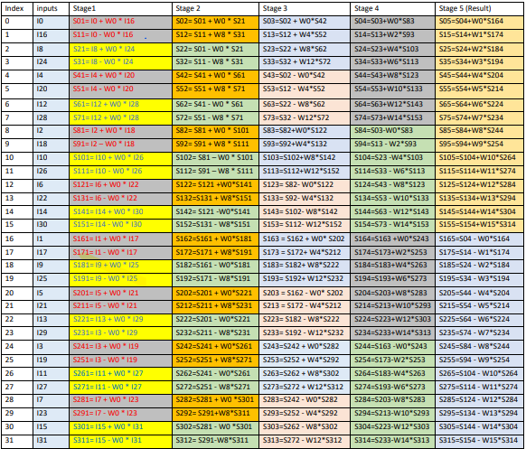
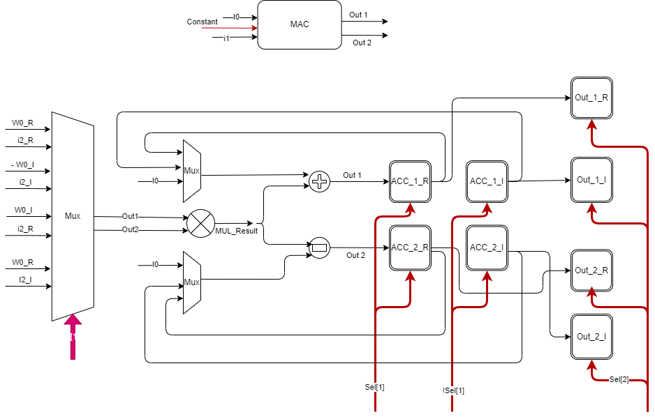
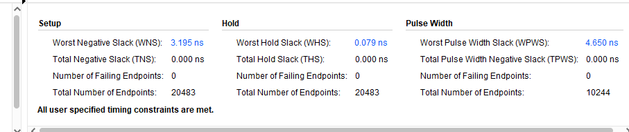

# 32-Point-FFT 
### Design
The design is Based on Cooley-Tukey algorithm, Where FFT operation is breaked down into 2-point FFT
Assumptions MAC works at a frequency of 100MHz.
FFT block should output 20M samples per second.
The samples input to the FFT block are output from an 8-bit ADC
### Verification 
Self checking UVM environment that Verify the result of the FFT block, the golden model is 
implemented inside the UVM environment utilizing System Verilog DPI feature that calls C++ function 
which call(s) python FFT function to have the result of the FFT input Vector and check it at the run time.

# The repository contains:
* PDF file showing the Stage Equations Based on signal Flow Graph. 
* shematic exported from vivado & Drawio illustrating the design of the MAC , Stage ,and the whole System
* Perl Scripts on for each stage that generate instantiation of the MACs blocks with same order of the equations
* Pyton Files for extraction of the constants and quantize it  
* Design Document containing the design & results 
* Verilog Files of the implemtation 
* Result of the Timing Simulation 
* UVM Verfication Enviroment 

## 32-Point-FFT Signal Flow

## Stage Equations

## MAC Block

## Timing Summary 

